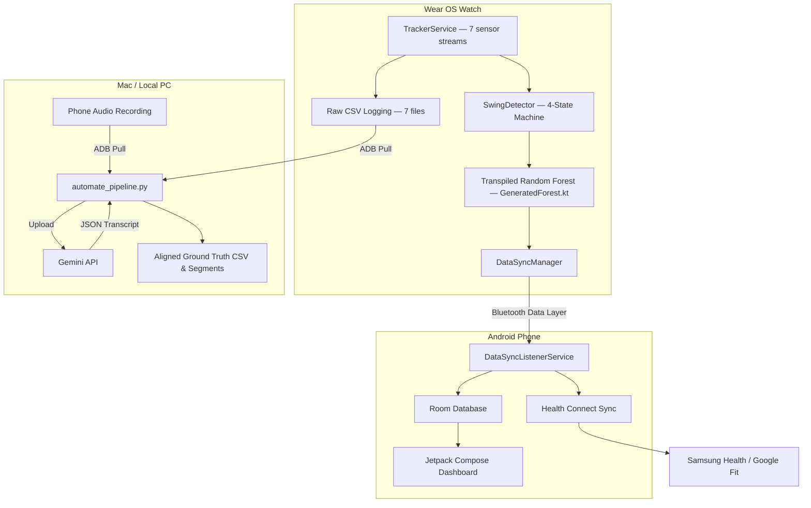
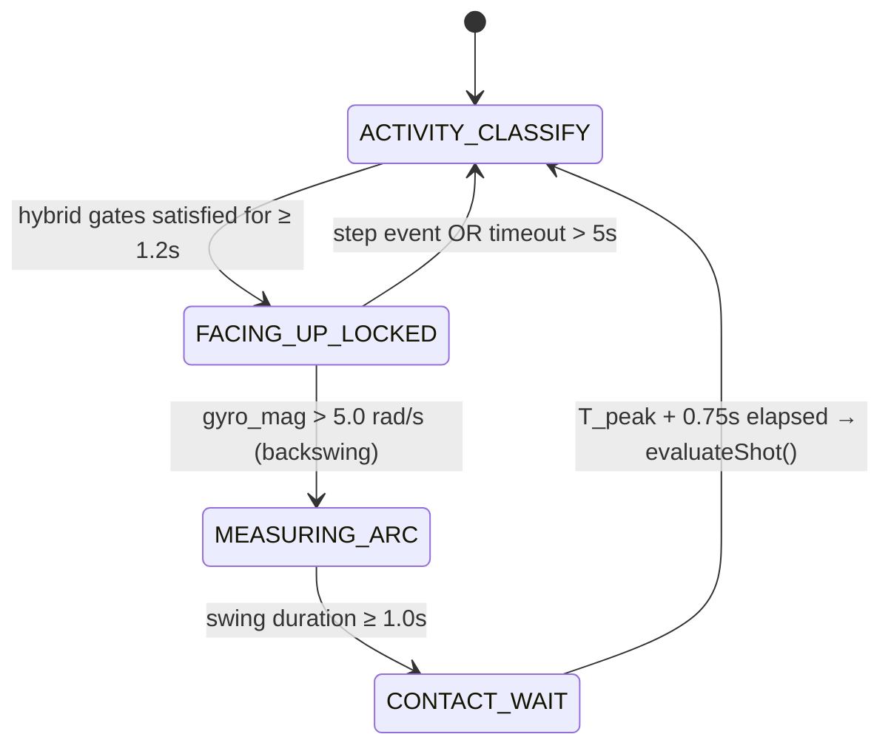

# Architecture: Pitch Analytix Pro

This document maps directories, API structures, database schemas, and data flow diagrams.

---

## 🏗️ System Architecture



---

## ⌚ Real-Time WearOS Kinematics State Machine (v3 — Hybrid Facing-Up Anchored)

The shot detection system uses a 4-state machine evaluated on every gyroscope event. The key architectural change is **anchoring all shot detection to a confirmed facing-up phase** using a hybrid M-of-N stance gate to eliminate false triggers from walking breaks or wiggles.



### State Descriptions

1. **`ACTIVITY_CLASSIFY`**: Evaluates the **Hybrid M-of-N Stance Gate (H9)** on every gyro sample:
   - **Mandatory Gates**:
     - **A.** `gyro_std(1s) < 1.2 rad/s` — bat must be still (not swinging)
     - **D.** No `TYPE_STEP_DETECTOR` event in the last **1.0s** — walking kill-switch
   - **Flexible Gates** (at least **1 of 3** must pass):
     - **B.** `accel_std(1s) < 2.0 m/s²` — no foot-strike shock
     - **C.** `ori_disp_mean(500ms) < 2.0°` — quaternion orientation locked at guard angle (bat not drifting)
     - **E.** `mean_gravity_y(1s) <= -3.5 m/s²` — arm extended downward toward bat (pose check)
   - Conditions must hold consecutively for **≥ 1.2s** (with a **1.5s break tolerance window** allowing recovery from transient wiggles) to transition to `FACING_UP_LOCKED`.
   - Suppressed for `POST_SHOT_GUARD_NS = 2.5s` after each shot.

2. **`FACING_UP_LOCKED`**: Stance is confirmed. Now watching for the bat to depart (backswing). Captures the reference stance quaternion from `TYPE_GAME_ROTATION_VECTOR`. Transitions:
   - → `MEASURING_ARC` when `gyro_mag > 5.0 rad/s`
   - → `ACTIVITY_CLASSIFY` on timeout (5.0s) or any `TYPE_STEP_DETECTOR` event

3. **`MEASURING_ARC`**: Tracks the full swing arc for 1.0s, recording the peak gyro magnitude and timestamp.

4. **`CONTACT_WAIT`**: Waits for `T_peak + 0.75s` of post-contact sensor data, then calls `evaluateShot()` and returns to `ACTIVITY_CLASSIFY`.

### Facing-Up Empirical Validation (session-2026-05-31_14-12-10)

| Metric | `gyro_std` alone (v1) | 4-condition gate (v2) | Hybrid M-of-N gate (H9, full) |
|---|---|---|---|
| Pre-shot window TP | 71% | ~40% | **78.3%** |
| Walk break FP | 59% | ~18% | **1.68 FPs/min** |

Key finding: The `TYPE_STEP_DETECTOR` fires every ~0.67s at walking pace (90 steps/min). The 1.0s recency window ensures virtually no walk period can sustain a 1.2s facing-up gate. But it does **not** fire during bat swings (DSP pedometer rejects the unilateral impulse pattern).

---

## 🔭 Sensor Stack (TrackerService)

| Sensor | Constant | Rate | Use in Detection |
|---|---|---|---|
| Accelerometer | `TYPE_ACCELEROMETER` | 50Hz | Contact shock detection; accel_std for facing-up gate |
| Gyroscope | `TYPE_GYROSCOPE` | 50Hz | Primary swing trigger; gyro_std for facing-up gate |
| Gravity | `TYPE_GRAVITY` | 50Hz | Gravity vector; used for linear accel computation fallback |
| Rotation Vector | `TYPE_ROTATION_VECTOR` | 50Hz | Logged for reference only (magnetometer-based; not fed to SwingDetector) |
| **Game Rotation Vector** | **`TYPE_GAME_ROTATION_VECTOR`** | **50Hz** | **Primary bat orientation quaternion fed to SwingDetector (no magnetometer — immune to bat/stump interference)** |
| **Step Detector** | **`TYPE_STEP_DETECTOR`** | **Event** | **Walking kill-switch in ACTIVITY_CLASSIFY; fires per foot-strike on hardware DSP** |
| Heart Rate | `TYPE_HEART_RATE` | NORMAL | BPM logged to session timeline only |

Raw logging writes: `WatchAccelerometer.csv`, `WatchGyroscope.csv`, `WatchGravity.csv`, `WatchOrientation.csv`, **`WatchGameOrientation.csv`**, **`WatchSteps.csv`**, and Heart Rate in timeline.

---

## 📂 Logical Workspace Layout
```
├── .agents/                    # Structured agent memory & rules
│   ├── rules/
│   │   └── operating_protocol.md
│   ├── ACTIVE_CONTEXT.md
│   ├── ARCHITECTURE.md
│   └── LEARNINGS.md
├── app/                        # Android companion app module
│   └── src/main/java/.../
│       ├── data/               # Room DB schema (InningsEvent, HeartRateEvent)
│       ├── services/           # DataSyncListenerService, HealthConnectManager
│       └── MainActivity.kt     # Jetpack Compose UI
├── wear/                       # Wear OS smartwatch app module
│   └── src/main/java/.../
│       ├── ml/                 # SwingDetector (4-state machine + biomechanical classifier)
│       ├── services/           # TrackerService (7 sensor streams)
│       └── MainActivity.kt     # Wear watch UI
├── automate_pipeline.py        # Python script for audio-sensor data collection & alignment
├── deploy_physical.sh          # Builds and installs debug APKs to physical watch
├── docs/
│   ├── batting_top_hand_biomechanics.md  # Reference doc defining stance/walking/running biomechanics
│   └── testing_guide.md            # Comprehensive instructions for running simulation/live sessions
└── scratch/                    # Simulation and diagnostic scripts
```

---

## 🔗 Key Code Linkages

### 1. Watch App (`:wear`)
*   **[TrackerService.kt](file:///Users/neilkloot/Code/CricketBattingTracker/wear/src/main/java/com/mrpeel/cricketbattingtracker/services/TrackerService.kt)**: Manages 7 sensor listeners (`TYPE_ACCELEROMETER`, `TYPE_GYROSCOPE`, `TYPE_GRAVITY`, `TYPE_ROTATION_VECTOR`, `TYPE_GAME_ROTATION_VECTOR`, `TYPE_STEP_DETECTOR`, `TYPE_HEART_RATE`), background wake locks, raw CSV formatting, step timeline logging, and event dispatch.
*   **[SwingDetector.kt](file:///Users/neilkloot/Code/CricketBattingTracker/wear/src/main/java/com/mrpeel/cricketbattingtracker/ml/SwingDetector.kt)**: 4-state machine (`ACTIVITY_CLASSIFY → FACING_UP_LOCKED → MEASURING_ARC → CONTACT_WAIT`). Holds kinematics state, rotates vectors relative to confirmed stance quaternion, classifies hit/miss, calculates metrics (speeds and ratings), and runs the compact flat-array transpiled Random Forest classifier (`GeneratedForest.kt`). Exposes `processStep()` for step detector events.

### 2. Phone App (`:app`)
*   **[DataSyncListenerService.kt](file:///Users/neilkloot/Code/CricketBattingTracker/app/src/main/java/com/mrpeel/cricketbattingtracker/services/DataSyncListenerService.kt)**: Listens for incoming timeline strings via Google Play Services Wearable APIs, parses and stores events in Room DB.
*   **[HealthConnectManager.kt](file:///Users/neilkloot/Code/CricketBattingTracker/app/src/main/java/com/mrpeel/cricketbattingtracker/services/HealthConnectManager.kt)**: Maps batting sessions parameters and heart rates to Google/Samsung Health Connect format.

### 3. Scripts & Reference
*   **[automate_pipeline.py](file:///Users/neilkloot/Code/CricketBattingTracker/automate_pipeline.py)**: Performs ADB pulls, audio conversions, calibration peak sync, Gemini transcribing, and segment slicing.
*   **[batting_top_hand_biomechanics.md](file:///Users/neilkloot/Code/CricketBattingTracker/docs/batting_top_hand_biomechanics.md)**: Defines the biomechanical states (Stance/Walk/Run) used to design the facing-up gate thresholds.
