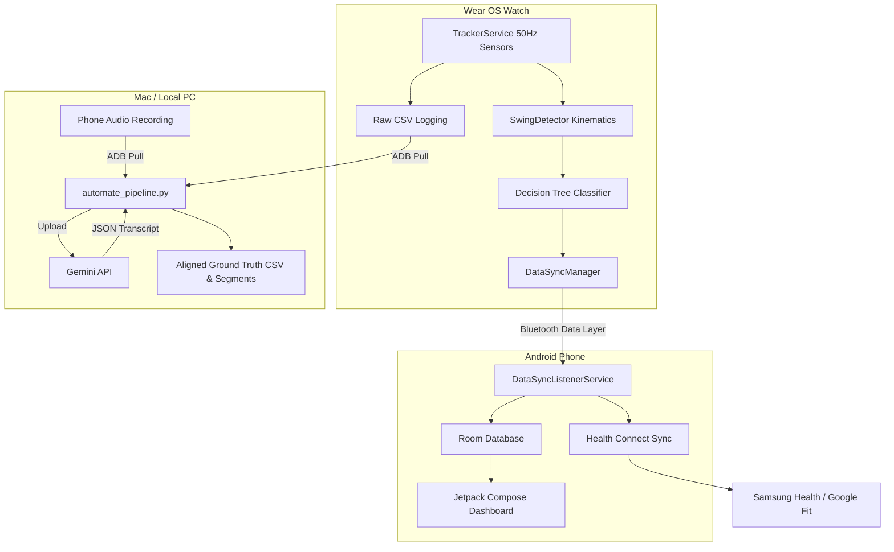
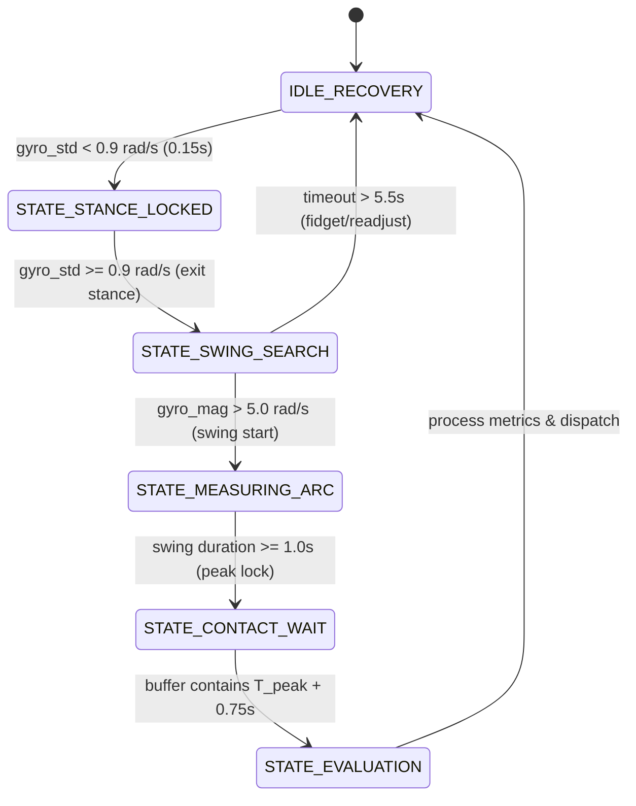

# Architecture: Pitch Analytix Pro

This document maps directories, API structures, database schemas, and data flow diagrams.

---

## 🏗️ System Architecture



---

## ⌚ Real-Time WearOS Kinematics State Machine

To enable allocation-free, O(1) stream processing of IMU data at 50Hz, the watch runs a state machine evaluated on every sensor event:



1.  **`IDLE_RECOVERY`**: Monitors the standard deviation of gyroscope magnitude over a trailing 0.5s window. If `gyro_std < 0.9 rad/s` for at least 0.15s, transitions to `STATE_STANCE_LOCKED`.
2.  **`STATE_STANCE_LOCKED`**: Locks the stance orientation to act as a relative coordination anchor. Transition to `STATE_SWING_SEARCH` when `gyro_std >= 0.9 rad/s` (user moves out of stance).
3.  **`STATE_SWING_SEARCH`**: Waits for swing initiation. Transitions to `STATE_MEASURING_ARC` if `gyro_magnitude > 5.0 rad/s`. Reverts to `IDLE_RECOVERY` if `timeout > 5.5s` without a swing (fidgeting).
4.  **`STATE_MEASURING_ARC`**: Measures rotational speed, identifying the absolute peak rotational velocity `T_peak`. Transitions to `STATE_CONTACT_WAIT` once swing duration exceeds 1.0s.
5.  **`STATE_CONTACT_WAIT`**: Buffers post-contact sensor data. Transitions to `STATE_EVALUATION` when the buffer holds up to `T_peak + 0.75s` (complete contact window context).
6.  **`STATE_EVALUATION`**: Evaluates the window `[T_peak - 0.45s, T_peak + 0.75s]` inside the accelerometer ring buffer. If `peak_accel >= 12.0 m/s²`, flags a **HIT**; otherwise, flags a **MISS**. Extracts biomechanical angles (relative wrist roll, swing plane verticality) and runs the native decision tree. Returns to `IDLE_RECOVERY`.

---

## 📂 Logical Workspace Layout
```
├── .agents/                    # Structured agent memory & rules
│   ├── rules/
│   │   └── operating_protocol.md
│   ├── ACTIVE_CONTEXT.md
│   ├── ARCHITECTURE.md
│   └── LEARNINGS.md
├── app/                        # Android companion app module
│   └── src/main/java/.../
│       ├── data/               # Room DB schema (InningsEvent, HeartRateEvent)
│       ├── services/           # DataSyncListenerService, HealthConnectManager
│       └── MainActivity.kt     # Jetpack Compose UI
├── wear/                       # Wear OS smartwatch app module
│   └── src/main/java/.../
│       ├── ml/                 # SwingDetector (Kinematics & Decision Tree)
│       ├── services/           # TrackerService (IMU sensor logging)
│       └── MainActivity.kt     # Wear watch UI
├── automate_pipeline.py        # Python script for audio-sensor data collection & alignment
├── deploy_physical.sh          # Builds and installs debug APKs to physical watch
└── testing_guide.md            # Comprehensive instructions for running simulation/live sessions
```

---

## 🔗 Key Code Linkages

### 1. Watch App (`:wear`)
*   **[TrackerService.kt](file:///Users/neilkloot/Code/CricketBattingTracker/wear/src/main/java/com/mrpeel/cricketbattingtracker/services/TrackerService.kt)**: Manages sensor listeners, background wake locks, raw CSV formatting, and events dispatch.
*   **[SwingDetector.kt](file:///Users/neilkloot/Code/CricketBattingTracker/wear/src/main/java/com/mrpeel/cricketbattingtracker/ml/SwingDetector.kt)**: Holds kinematics state, rotates vectors relative to stance, classifies hit/miss, calculates metrics (speeds and ratings), and runs the classifier decision tree.

### 2. Phone App (`:app`)
*   **[DataSyncListenerService.kt](file:///Users/neilkloot/Code/CricketBattingTracker/app/src/main/java/com/mrpeel/cricketbattingtracker/services/DataSyncListenerService.kt)**: Listens for incoming timeline strings via Google Play Services Wearable APIs, parses and stores events in Room DB.
*   **[HealthConnectManager.kt](file:///Users/neilkloot/Code/CricketBattingTracker/app/src/main/java/com/mrpeel/cricketbattingtracker/services/HealthConnectManager.kt)**: Maps batting sessions parameters and heart rates to Google/Samsung Health Connect format.

### 3. Scripts
*   **[automate_pipeline.py](file:///Users/neilkloot/Code/CricketBattingTracker/automate_pipeline.py)**: Performs ADB pulls, audio conversions, calibration peak sync, Gemini transcribing, and segment slicing.
