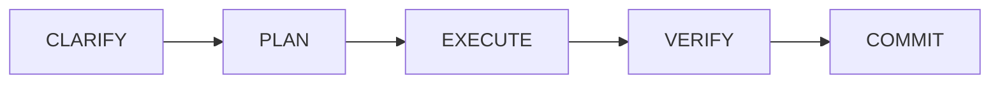

# Operating Protocol: Pitch Analytix Pro

## 📜 Core Directives

1.  **Stateless Operations**: I am the architect; you are the executor. You must read `AGENTS.md` and `.agents/ACTIVE_CONTEXT.md` before performing any task.
2.  **State Gatekeeping**: Do not modify any core code unless the current phase in `.agents/ACTIVE_CONTEXT.md` matches the intended operation.
3.  **Memory Persistence**: After every session, update `.agents/LEARNINGS.md` with a summary of the technical decisions made.
4.  **Verification**: Every code-change task must end with a self-verification check against `.agents/ACTIVE_CONTEXT.md`.

---

## 🔄 Ideal Workflow Stages

### 1. CLARIFY
*   **Action**: The model reviews the task requirements.
*   **Tooling**: Propose or run the `/grill-me` command to resolve ambiguities or seek architectural direction from the architect.

### 2. PLAN
*   **Action**: Write an Implementation Plan document (including any open questions or breaking design choices) to the artifact directory.
*   **Approval Gate**: Await explicit user approval before modifying any code.

### 3. EXECUTE
*   **Action**: Propose and apply the code modifications.
*   **Confinement**: Keep context clean; apply changes incrementally. If using subagents, delegate isolated tasks within temporary contexts (keeping resource usage within a 30% limit).

### 4. VERIFY
*   **Action**: Validate the correctness of the code changes.
*   **Tooling**: Run automated test suites (such as `SwingDetectorGroundTruthTest`), execute checking scripts, or inspect logs. Self-verify outputs against target metrics.

### 5. COMMIT
*   **Action**: Commit changes to local version control.
*   **Standard**: Use atomic commits with descriptive commit messages. Stage only modified/new files relevant to the active task.
