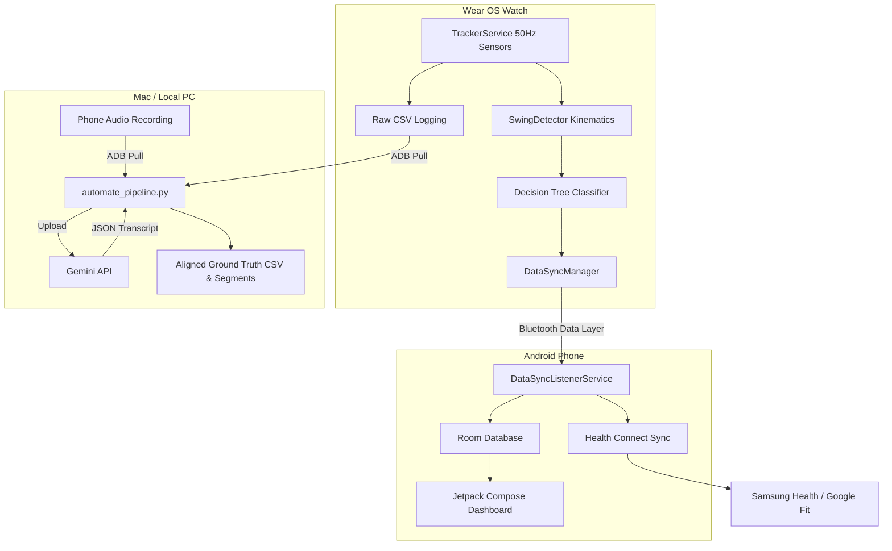

# Project: Pitch Analytix Pro (Cricket Batting Tracker)

Pitch Analytix Pro is a professional-grade cricket training companion. It leverages high-frequency Wear OS IMU (Inertial Measurement Unit) sensors, machine learning, biomechanical analysis, and mobile companion dashboards to track batting sessions, classify stroke types, measure bat speeds, and sync with health networks.

---

## 🎯 Core Objectives
1. **Real-time Swing Kinematics**: Capture and analyze wrist and bat movements at 50Hz directly on the Wear OS watch.
2. **Stroke Classification**: Automatically classify cricket shots (e.g., Cover Drive, Pull Shot, Flick/On Drive, Defence) using a hybrid biomechanical decision tree.
3. **Data Integration**: Securely synchronize batting metrics and workout statistics from the watch to the phone companion app, and into Samsung Health via Android Health Connect.
4. **Data Sourcing Pipeline**: Streamline the capture of high-fidelity sensor logs aligned with audio narration ground-truth via Gemini API to build a dataset for future ML model iterations.

---

## 🏗️ System Architecture

---

## 💻 Tech Stack
*   **Wear OS & Android App**: Kotlin, Jetpack Compose, Room DB, Wearable Data Layer API, Health Services Exercise Client, Coroutines & Flows.
*   **Data Pipeline**: Python 3, NumPy, Pandas, SciPy (Signal processing), the `google-genai` Python SDK, macOS `afconvert`.
*   **Infrastructure**: Git, ADB, Gradle.
