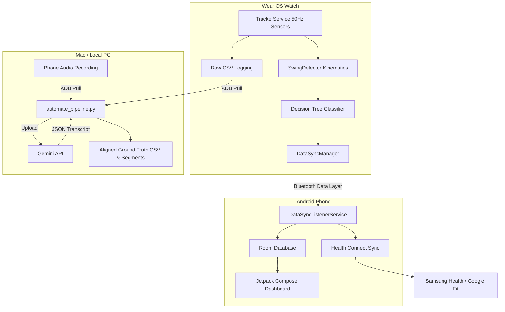
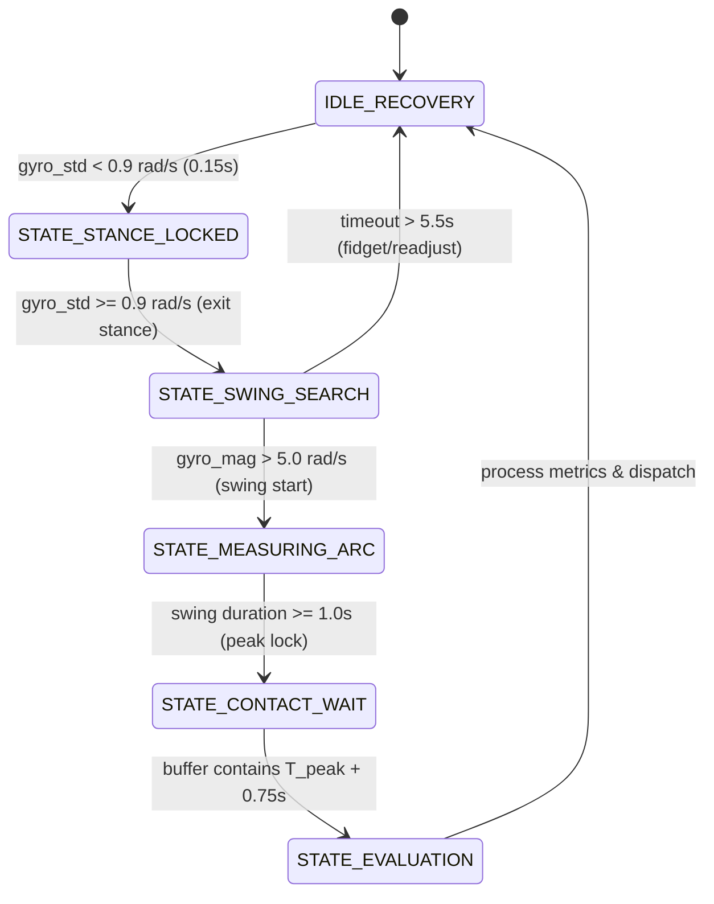

# Project: Pitch Analytix Pro (Cricket Batting Tracker)

Pitch Analytix Pro is a professional-grade cricket training companion. It leverages high-frequency Wear OS IMU (Inertial Measurement Unit) sensors, local machine learning, biomechanical analysis, and companion mobile dashboards to track batting sessions, classify stroke types, measure bat speeds, and sync with health networks.

---

## 🎯 High-Level Vision & "The Digital Pavilion"

### Visual Language & Foundation
*   **Creative North Star**: "The Digital Pavilion"
*   **Design Theme**: High-contrast, pitch-black dark mode optimized for OLED battery efficiency and glanceability during high-intensity sports activity.
*   **Design System Tokens**:
    *   **Background**: `#000000` (True Black for OLED screen battery conservation) / `#001B3D` (Deep Navy accents).
    *   **Primary Color**: `#58FF63` (Neon Green - Action, high-visibility, active tracking status).
    *   **Secondary Color**: `#BCD2FE` (Light Blue - Secondary metrics and historical averages).
    *   **Typography**: `Space Grotesk` (Modern, geometric, highly legible at a glance).
    *   **Roundness**: `Round Four` (Circular/organic shapes optimized for round watch faces).

---

## 🏗️ System Architecture

---

## ⌚ Real-Time WearOS Kinematics State Machine

To enable O(1) allocation-free stream processing of IMU data at 50Hz, the watch runs a state machine evaluated on every sensor event:

1.  **`IDLE_RECOVERY`**: Monitors the standard deviation of gyroscope magnitude over a trailing 0.5s window. If `gyro_std < 0.9 rad/s` for at least 0.15s, transitions to `STATE_STANCE_LOCKED`.
2.  **`STATE_STANCE_LOCKED`**: Locks the stance orientation to act as a relative coordination anchor. Transition to `STATE_SWING_SEARCH` when `gyro_std >= 0.9 rad/s` (user moves out of stance).
3.  **`STATE_SWING_SEARCH`**: Waits for swing initiation. Transitions to `STATE_MEASURING_ARC` if `gyro_magnitude > 5.0 rad/s`. Reverts to `IDLE_RECOVERY` if `timeout > 5.5s` without a swing (fidgeting).
4.  **`STATE_MEASURING_ARC`**: Measures rotational speed, identifying the absolute peak rotational velocity `T_peak`. Transitions to `STATE_CONTACT_WAIT` once swing duration exceeds 1.0s.
5.  **`STATE_CONTACT_WAIT`**: Buffers post-contact sensor data. Transitions to `STATE_EVALUATION` when the buffer holds up to `T_peak + 0.75s` (complete contact window context).
6.  **`STATE_EVALUATION`**: Evaluates the window `[T_peak - 0.45s, T_peak + 0.75s]` inside the accelerometer ring buffer. If `peak_accel >= 12.0 m/s²`, flags a **HIT**; otherwise, flags a **MISS**. Extracts biomechanical angles (relative wrist roll, swing plane verticality) and runs the native decision tree. Returns to `IDLE_RECOVERY`.

---

## 💻 Tech Stack
*   **Wear OS & Android App**: Kotlin, Jetpack Compose, Room DB, Wearable Data Layer API, Health Services Exercise Client, Coroutines & Flows.
*   **Data Pipeline**: Python 3, NumPy, Pandas, SciPy (Signal processing), the `google-genai` Python SDK, macOS `afconvert`.
*   **Infrastructure**: Git, ADB, Gradle.
