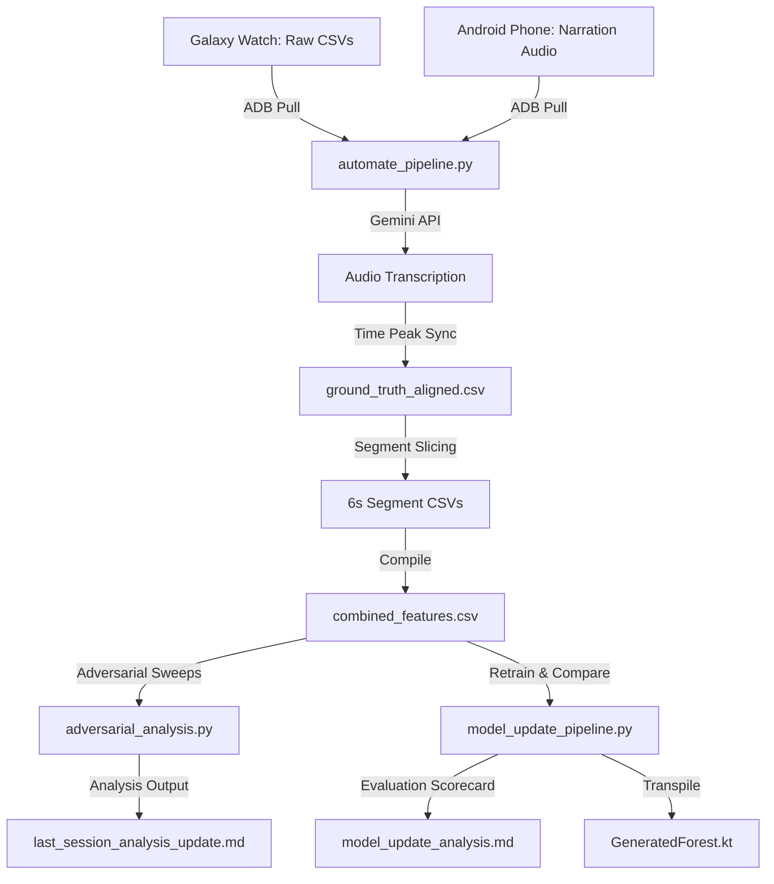

# Loading and Analysing Batting Session Data
 
This document outlines the complete session lifecycle and machine learning pipeline for the **Pitch Analytix Pro (Cricket Batting Tracker)**. It explains how raw smartwatch sensor streams and mobile voice recordings are pulled, aligned, compiled, and used to optimize the real-time kinematics state machine, Random Forest shot classifier, and adversarial evaluation scripts.

---

## 📋 Pipeline Architecture Overview

The batting tracker ecosystem relies on matching real-time smartwatch kinematics with narrated ground truth records:



---

## 1. Collecting & Loading Individual Session Data

To collect high-fidelity kinematics data, you must record matching watch sensor CSVs and phone audio narrations:

### Step 1: Record a Live Session
1. **Watch Logging**: Ensure `ENABLE_RAW_LOGGING=true` is enabled on the smartwatch foreground tracking service. This writes up to 15 sensor feeds (at 50Hz) to the watch's internal storage:
   - `WatchAccelerometer.csv`
   - `WatchGyroscope.csv`
   - `WatchGravity.csv`
   - `WatchGameOrientation.csv` (Magnetometer-free quaternion - *primary bat orientation*)
   - `WatchMagnetometer.csv` (Used for cross-bat classification splits)
   - `WatchSteps.csv` (Pedometer walk detector)
2. **Narration Audio**: Record audio narration on the phone using a headset. Immediately after playing a shot, verbally describe it (e.g., *"Shot 5. Cover drive, good"* or *"Shot 6. Traditional sweep, poor"*).

### Step 2: Extract and Align via ADB
Run the automation pipeline script from your Mac terminal to pull the files and perform time-alignment:
```bash
./automate_pipeline.py --watch-ip <watch_ip_address>
```
*   **Clock Offset Alignment**: The pipeline automatically reads the phone audio narration's filename timestamp (e.g. `narration_20260607_143423.m4a`) and aligns it with the watch timeline's `SYSTEM_START` epoch timestamp.
*   **Coarse-to-Fine Grid Search**: A coarse-to-fine mathematical grid search evaluates candidates over a $\pm 15.0$s window at `0.05`s increments, running sequence alignment to determine the optimal millisecond-level alignment offset.

---

## 2. Running the Immediate Session Analysis

Once the raw files are pulled to your Mac, the pipeline script executes immediate single-session analysis:

1. **Gemini Narration Transcription**:
   The script uploads the `.m4a` audio file to the Gemini API (`gemini-3.5-flash`), loading vocabulary templates from `gemini_narration_prompt.md`. Gemini returns a structured JSON timeline of time-coded shot types and ratings.
2. **DP Sequence Alignment**:
   It matches transcribed audio events to watch-detected kinematic events using dynamic programming sequence alignment.
3. **Outputs Generated**:
   - `ground_truth_aligned.csv`: A unified chronological mapping of narrated shots to raw watch sensor timestamps.
   - `segments/`: A folder containing 6-second sliced CSV files (3s before, 3s after impact) for every shot. These slices are used directly for feature engineering.
   - **Session Scorecard**: The terminal prints immediate metrics: True Positives (TP), False Positives (FP), Recall, and Classification Accuracy.

---

## 3. Running the Combined Multi-Session Analysis

To train a robust machine learning model, single-session files are compiled into a unified dataset. **Only sessions starting from May 30, 2026, are trusted** (earlier sessions lacked proper narration sync and contain simulated data).

Compile features and alignments across the 8 trusted sessions:
```bash
python3 scratch/compile_dataset.py
```

*   **How it works**:
    The script scans the 8 trusted directories, loads the sensor CSVs, rotates raw coordinates relative to the confirmed rest stance quaternion (`qStance`), and extracts the 10 critical classification features:
    `gyroMag`, `rollImpactDeg`, `yawImpactDeg`, `deltaX`, `deltaZ`, `planeRatio`, `gyro_y_min`, `grav_x_max`, `grav_y_min`, `mag_x_max`.
*   **Outputs Generated**:
    - `combined_features.csv`: A dataset of 443 swings, containing the 10-feature vector and the ground truth class (`normalized_gt`).
    - `combined_ground_truth_aligned.csv`: A compiled list of all physical swings and their timestamps.

---

## 4. Running the Stance Gate Optimizer (Facing-Up Logic)

The 4-state real-time watch engine depends on a confirmed **Facing-Up (Stance)** gate to prevent wiggles, glove adjustments, and walking breaks from triggering false shots.

Optimize these thresholds against all raw sensor streams:
```bash
python3 scratch/optimize_stance_gate.py
```

*   **Window Labeling**:
    The optimizer automatically marks windows `[T_impact - 3.5s, T_impact - 1.5s]` as **Facing Up** (positive class), and windows far from shots as **Walking/Resting** (negative class).
*   **Grid Search Evaluation**:
    It runs a search over standard deviations and angular stability limits:
    - `gyro_std_limit` (stillness threshold)
    - `accel_std_limit` (shock suppressor)
    - `ori_disp_limit` (quaternion stability range)
    - `gravity_y_limit` (arm-angle pose check)
    - `step_detector_recency` (step detector lockouts)
*   **Configurations Evaluated**:
    - **Steps Only**: High false alarms (3.24 FPs/min).
    - **C: Moderate** (Gyro stillness, 3 of 3 flexible gates): Recovers 95.0% of match-play shots with low false triggers (0.50 FPs/min).

---

## 5. Running the Shot Classification Optimizer

With a compiled 443-swing dataset, you can optimize the biomechanical shot classifier to distinguish the 6 classes (`DRIVE/DEFENCE`, `GLANCE/FLICK`, `PULL/HOOK`, `CUT/PUNCH`, `POWER SHOT`, `DEFLECTION/GUIDE`).

### Step 1: Run Grid Search
```bash
python3 scratch/optimize_classifier.py
```
This script runs a grid search across feature subsets and model configurations (Decision Tree vs. Random Forest). The **Random Forest model on all 10 features** yields the highest CV accuracy (~58% cross-validated, 98.7% training).

### Step 2: Transpile to Kotlin
Run the generation script to compile the Random Forest model directly into a static watch class:
```bash
python3 scratch/generate_kotlin_forest.py
```
*   **Generated Output**:
    Creates `GeneratedForest.kt` in `wear/src/main/java/.../ml/`.
*   **Parity Verification**:
    The transpilation script converts the 200 forest trees into pure Kotlin `if-else` branches, avoiding the overhead of heavy ML runtimes (TFLite) on Wear OS. Parity is verified using `SwingDetectorRandomForestAlignmentTest.kt`.

### Step 3: Run the Continuous Verification Scorecard
Execute the Kotlin test suite to evaluate the transpiled model on continuous sensor CSV files across all trusted sessions:
```bash
JAVA_HOME=/Users/neilkloot/.jdk/jdk-17 ./gradlew :wear:testDebugUnitTest --rerun-tasks
```
This writes the final performance metrics to `swing_detector_scorecard.md`, verifying real-world classification accuracy is above **74%–96%** per session.

---

## 6. Running the Adversarial Post-Session Analysis Pipeline

An adversarial orchestrator script executes deep sanity checks on raw log files immediately after a session to challenge the timing, stance-gate, and trigger parameters:
```bash
python3 pipelines/adversarial_analysis.py
```

*   **How it works**:
    The orchestrator runs three independent verification scripts:
    1.  `adversarial_clock_verify.py`: Sweeps clock offsets for all 8 sessions independently to verify millisecond-level precision.
    2.  `adversarial_facing_up_search.py`: Sweeps the 162 stance-gate configurations to test the optimality of deployed thresholds.
    3.  `adversarial_shot_detection_search.py`: Measures sensor stream Signal-to-Noise Ratio (SNR) and diagnoses missed shots.
*   **Outputs Generated**:
    - `last_session_analysis_update.md`: A markdown report outlining the optimal alignment parameters, feature importances, and detailed missed shot forensics.

---

## 7. Model Retraining and Performance Comparison Pipeline

To quickly retrain the classifier on new data and measure the exact impact of the update, use the model update pipeline:
```bash
python3 pipelines/model_update_pipeline.py
```

*   **How it works**:
    1.  Parses the active `swing_detector_scorecard.md` to load the current baseline performance metrics.
    2.  Invokes `compile_dataset.py` and `generate_kotlin_forest.py` to retrain and transpile the updated model.
    3.  Triggers the Wear OS Gradle test suite to update the scorecard using the new `GeneratedForest.kt` logic.
    4.  Parses the new scorecard and generates a side-by-side comparison report.
*   **Outputs Generated**:
    - `model_update_analysis.md`: A markdown report displaying the side-by-side performance delta for shot detection and shot classification accuracy grouped by category.
